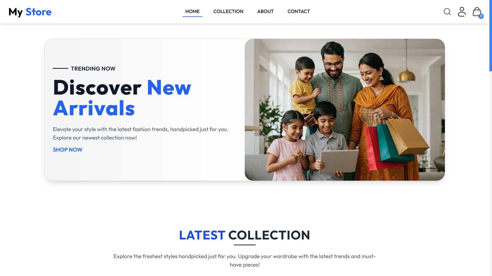
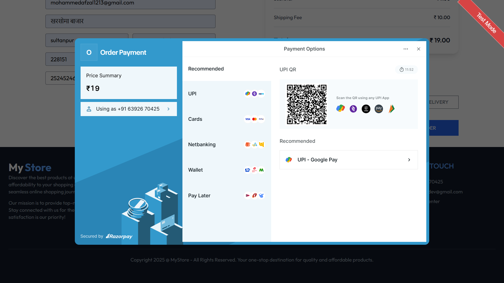
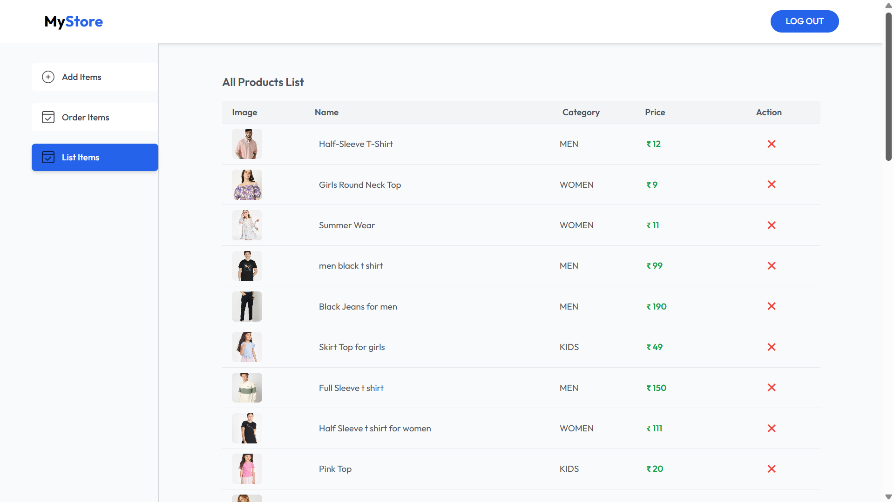

## Screenshots:

### Homepage:


### Product Listing:


<!-- ### Product Details:


### Cart:


### Checkout & Payment:


# E-Commerce Website Application

This is a full-stack e-commerce website built using the MERN (MongoDB, Express, React, Node.js) stack. The application includes user authentication, product listings, a cart system, and payment integration using Razorpay and Stripe. 

## Features:
- **User Registration and Login**: Users can sign up, log in, and securely store passwords using JWT authentication.
- **Product Listing**: Products are displayed dynamically with options to filter and search.
- **Cart Management**: Users can add items to the cart and proceed to checkout.
- **Payment Integration**: Payments are processed using Razorpay and Stripe.
- **Admin Panel**: Admins can manage products, view orders, and handle user accounts.
- **Cloudinary**: For storing and serving product images.

## Live Links:
- **Frontend**: [https://myshop-1-97f4.onrender.com/](https://myshop-1-97f4.onrender.com/)
- **Admin Panel**: [https://myshop-admin.onrender.com](https://myshop-admin.onrender.com)


## Technology Stack:
- **Frontend**: React.js, Tailwind CSS
- **Backend**: Node.js, Express.js
- **Database**: MongoDB, Mongoose
- **Payment Gateway**: Razorpay, Stripe
- **Authentication**: JWT, Bcrypt
- **Image Hosting**: Cloudinary


4. Start the backend server:
   ```bash
   cd backend
   npm run dev
   ```

5. Start the frontend server:
   ```bash
   cd frontend
   npm start
   ```

## Environment Variables

Ensure to set up the following environment variables in your `.env` file:

- **RAZORPAY_KEY_ID**: Your Razorpay public key.
- **RAZORPAY_KEY_SECRET**: Your Razorpay secret key.
- **STRIPE_SECRET_KEY**: Your Stripe secret key.
- **JWT_SECRET**: Secret key for JWT authentication.
- **ADMIN_EMAIL**: Admin email (used for login).
- **ADMIN_PASSWORD**: Admin password (used for login).
- **MONGODB_URI**: MongoDB connection URI for the database.
- **CLOUDINARY_NAME**: Your Cloudinary cloud name.
- **CLOUDINARY_API_KEY**: Your Cloudinary API key.
- **CLOUDINARY_SECRET_KEY**: Your Cloudinary secret key.

## License:
This project is licensed under the MIT License - see the [LICENSE](LICENSE) file for details.

## Acknowledgments:
- [Razorpay](https://razorpay.com) for the payment gateway.
- [Stripe](https://stripe.com) for the payment gateway.
- [Cloudinary](https://cloudinary.com) for image hosting.

---

For any issues or feedback, feel free to reach out to me via email: mohammedafzal1213@gmail.com.

#mern
#ecommerce
#nodejs
#reactjs
#open_source
#context_Api
#payment-gateway
#razor_Pay -->